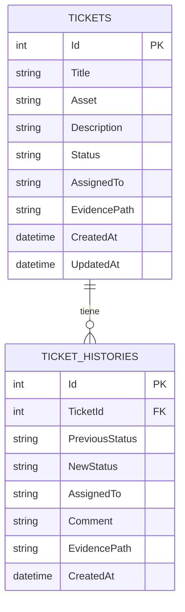
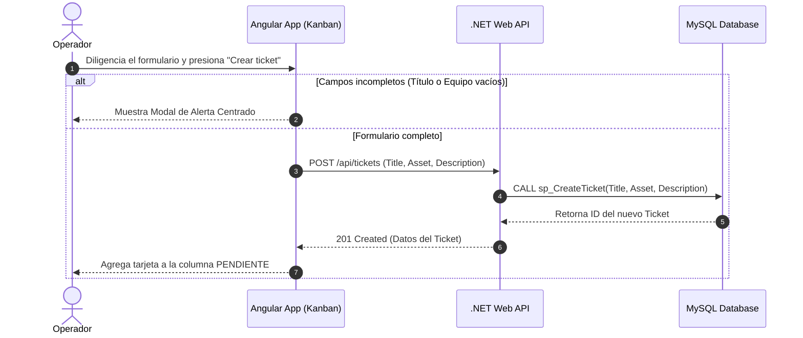
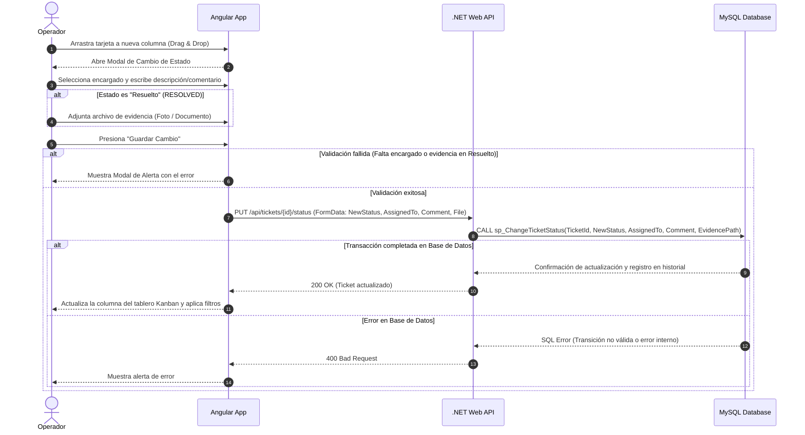
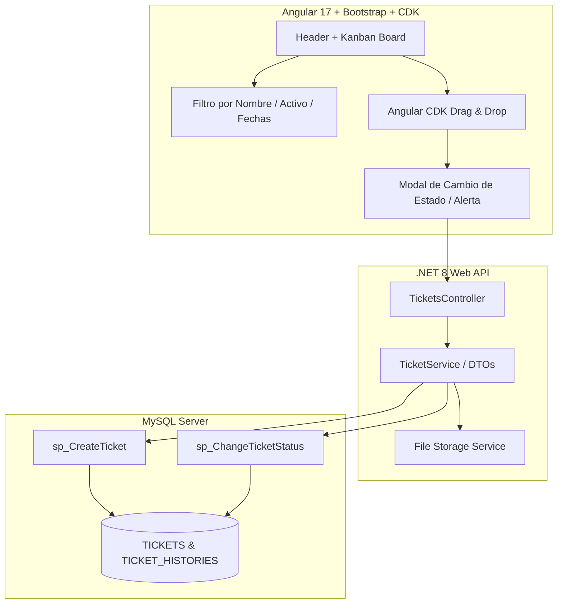

# 🎫 FRAC·T·AL Ticket Control — Kanban Ticket Management System

An end-to-end, full-stack maintenance ticket management system built with **Angular 17**, **.NET 8 Web API**, and **MySQL**. Featuring an interactive Kanban board with Drag & Drop functionality, status transitions with mandatory evidence validation, real-time filtering, custom error alert modals, and institutional branding.

---

## 📑 Table of Contents
- [Features](#-features)
- [Tech Stack](#-tech-stack)
- [System Architecture & Diagrams](#-system-architecture--diagrams)
- [Database Setup](#-database-setup)
- [Getting Started](#-getting-started)
  - [Prerequisites](#prerequisites)
  - [Backend Setup (.NET 8)](#backend-setup-net-8)
  - [Frontend Setup (Angular 17)](#frontend-setup-angular-17)
- [Branching Strategy](#-branching-strategy)
- [License](#-license)

---

## 🚀 Features

- 📋 **Interactive Kanban Board**: Dynamic management across three columns (`Pending`, `In Progress`, `Resolved`) powered by Angular CDK Drag & Drop.
- 🖼️ **Evidence & Assignment Enforcement**: Mandatory assignment of a responsible person upon status change, and enforced attachment of resolution evidence (images/documents) when closing tickets (`Resolved`).
- 🔍 **Real-Time Multi-Filter Search**: Search cards dynamically by **Ticket Title**, **Asset / Equipment Code**, or date ranges (**Date From** / **Date To**).
- ❌ **Custom Validation Modals**: Centered alert modal with visual indicators (`❌`) replacing native browser alerts for incomplete form fields.
- 🎨 **Institutional Branding**: Top navigation bar displaying `FRAC·T·AL Maintenance · Tickets` along with active user profile identification (`Operador OP`).
- ⚡ **Stored Procedure Architecture**: High-performance backend integration utilizing MySQL stored procedures (`sp_CreateTicket` and `sp_ChangeTicketStatus`).

---

## 🛠️ Tech Stack

| Layer | Technology |
| :--- | :--- |
| **Frontend** | Angular 17, TypeScript, Angular CDK (Drag & Drop), Bootstrap 5, RxJS |
| **Backend** | .NET 8 Web API, Entity Framework Core / Dapper, C# |
| **Database** | MySQL 8.0 (Stored Procedures & History Logs) |
| **Version Control**| Git, GitHub (Git Flow branching) |

---

## 📐 System Architecture & Diagrams

## 1. Diagrama Entidad-Relación (ERD) Actualizado

## 2. Diagrama de Secuencia - Flujo de Creación de Tickets y Alerta de Validación

## 3. Diagrama de Secuencia - Transición de Estado (Drag & Drop, Asignación y Evidencia)

## 4. Diagrama de Componentes de la Arquitectura (Vista General)

🗄️ Database Setup
Run the MySQL scripts located in the /database folder to generate tables and stored procedures:

SQL
-- 1. Create Stored Procedure: Create Ticket
DELIMITER //
CREATE PROCEDURE sp_CreateTicket(
    IN p_Title VARCHAR(255),
    IN p_Asset VARCHAR(100),
    IN p_Description TEXT
)
BEGIN
    INSERT INTO TICKETS (Title, Asset, Description, Status, CreatedAt, UpdatedAt)
    VALUES (p_Title, p_Asset, p_Description, 'PENDING', NOW(), NOW());
    
    SELECT LAST_INSERT_ID() AS TicketId;
END //
DELIMITER ;

-- 2. Create Stored Procedure: Change Ticket Status
DELIMITER //
CREATE PROCEDURE sp_ChangeTicketStatus(
    IN p_TicketId INT,
    IN p_NewStatus VARCHAR(50),
    IN p_AssignedTo VARCHAR(255),
    IN p_Comment TEXT,
    IN p_EvidencePath VARCHAR(500)
)
BEGIN
    DECLARE v_OldStatus VARCHAR(50);
    
    SELECT Status INTO v_OldStatus FROM TICKETS WHERE Id = p_TicketId;
    
    UPDATE TICKETS 
    SET Status = p_NewStatus, 
        AssignedTo = p_AssignedTo, 
        EvidencePath = COALESCE(p_EvidencePath, EvidencePath),
        UpdatedAt = NOW()
    WHERE Id = p_TicketId;
    
    INSERT INTO TICKET_HISTORIES (TicketId, PreviousStatus, NewStatus, AssignedTo, Comment, EvidencePath, CreatedAt)
    VALUES (p_TicketId, v_OldStatus, p_NewStatus, p_AssignedTo, p_Comment, p_EvidencePath, NOW());
END //
DELIMITER ;

🚦 Getting Started
Prerequisites
Node.js (v18 or higher)

Angular CLI (npm install -g @angular/cli)

.NET 8 SDK

[suspicious link removed]

Backend Setup (.NET 8)
Clone the repository:

Bash
git clone [https://github.com/Pablopiblo13/fractal-ticket-control.git](https://github.com/Pablopiblo13/fractal-ticket-control.git)
cd fractal-ticket-control/backend
Configure your MySQL connection string in appsettings.json:

JSON
"ConnectionStrings": {
  "DefaultConnection": "Server=localhost;Database=fractal_db;Uid=root;Pwd=yourpassword;"
}
Restore dependencies and run the API:

Bash
dotnet restore
dotnet run
The API will start at https://localhost:7001 or http://localhost:5000.

Frontend Setup (Angular 17)
Navigate to the frontend directory:

Bash
cd ../frontend
Install dependencies:

Bash
npm install
Run the development server:

Bash
ng serve
Open your browser and navigate to http://localhost:4200/.

🌿 Branching Strategy
This project follows Git Flow:

main: Production-ready code.

develop: Integration branch for features.

feature/*: Specific topic branches (feature/database-schema, feature/backend-api, feature/frontend-angular, feature/add-ticket-form).

docs/*: Documentation updates (docs/update-architecture-readme).

📄 License
Distributed under the MIT License. See LICENSE for more information.
