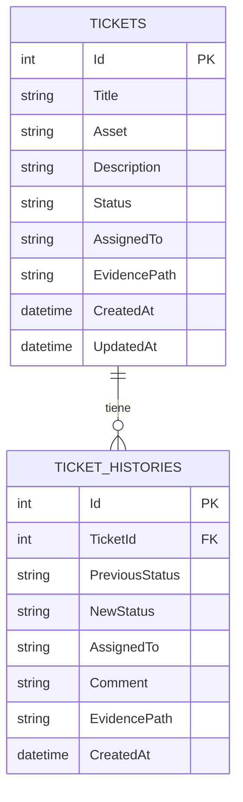
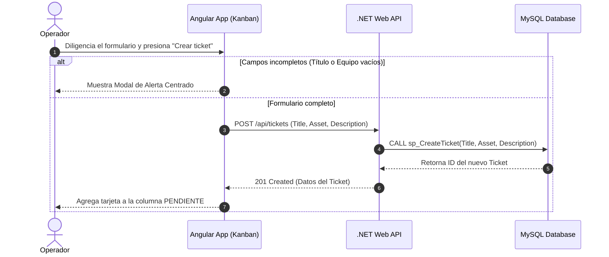
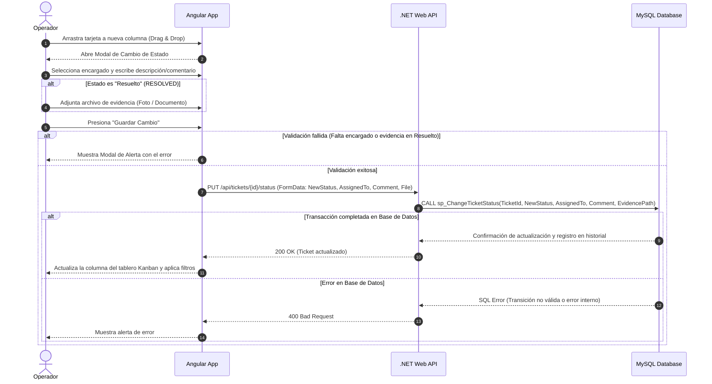

# 🎫 FRAC·T·AL Ticket Control — Kanban Ticket Management System

An end-to-end, full-stack maintenance ticket management system built with **Angular 17**, **.NET 8 Web API**, and **MySQL**. Featuring an interactive Kanban board with Drag & Drop functionality, status transitions with mandatory evidence validation, real-time filtering, custom error alert modals, institutional branding, and fully deployed in production on **Railway**.

---

## 🌐 Live Demo / Production URL
- **Frontend App**: [https://fractal-ticket-control-production.up.railway.app](https://fractal-ticket-control-production.up.railway.app)
- **Backend API**: [https://glistening-tranquility-production-323a.up.railway.app](https://glistening-tranquility-production-323a.up.railway.app)

---

## 📑 Table of Contents
- [Features](#-features)
- [Tech Stack](#-tech-stack)
- [System Architecture & Cloud Deployment](#-system-architecture--cloud-deployment)
- [System Architecture & Diagrams](#-system-architecture--diagrams)
- [Database Setup](#-database-setup)
- [Getting Started (Local Development)](#-getting-started-local-development)
  - [Prerequisites](#prerequisites)
  - [Backend Setup (.NET 8)](#backend-setup-net-8)
  - [Frontend Setup (Angular 17)](#frontend-setup-angular-17)
- [Branching Strategy](#-branching-strategy)
- [License](#-license)

---

## 🚀 Features

- 📋 **Interactive Kanban Board**: Dynamic management across three columns (`Pending`, `In Progress`, `Resolved`) powered by Angular CDK Drag & Drop.
- 🖼️ **Evidence & Assignment Enforcement**: Mandatory assignment of a responsible person upon status change, and enforced attachment of resolution evidence (images/documents) when closing tickets (`Resolved`).
- 🔍 **Real-Time Multi-Filter Search**: Search cards dynamically by **Ticket Title**, **Asset / Equipment Code**, or date ranges (**Date From** / **Date To**).
- ❌ **Custom Validation Modals**: Centered alert modal with visual indicators (`❌`) replacing native browser alerts for incomplete form fields.
- 🎨 **Institutional Branding**: Top navigation bar displaying `FRAC·T·AL Maintenance · Tickets` along with active user profile identification (`Operador OP`).
- ⚡ **Stored Procedure Architecture**: High-performance backend integration utilizing MySQL stored procedures (`sp_CreateTicket` and `sp_ChangeTicketStatus`).

---

## 🛠️ Tech Stack

| Layer | Technology & Cloud Services |
| :--- | :--- |
| **Frontend** | Angular 17, TypeScript, Angular CDK (Drag & Drop), Bootstrap 5, RxJS (Hosted on **Railway**) |
| **Backend** | .NET 8 Web API, Entity Framework Core, C# (Hosted on **Railway**) |
| **Database** | MySQL 8.0, Stored Procedures & History Logs (Hosted on **Railway Database Service**) |
| **Version Control**| Git, GitHub (Git Flow branching) |

---

## ☁️ System Architecture & Cloud Deployment

The application is structured in a **decoupled architecture**, distributed across three independent services managed within **Railway**:

1. **Frontend Service**: Serves the optimized production build of Angular using `npx serve` on port `8080`. Communicates directly with the cloud backend via configured environment variables (`environment.ts`).
2. **Backend Service**: A containerized .NET 8 Web API exposing REST endpoints, configured with CORS policies (`AllowAngular`) to safely accept requests exclusively from the frontend domain.
3. **MySQL Service**: A cloud-managed relational database storing operational tables and handling high-performance transactions via stored procedures.

---

## 📐 System Architecture & Diagrams

### 1. Diagrama Entidad-Relación (ERD) Actualizado

### 1. Diagrama Entidad-Relación (ERD) Actualizado



### 2. Diagrama de Secuencia - Flujo de Creación de Tickets y Alerta de Validación



### 3. Diagrama de Secuencia - Transición de Estado (Drag & Drop, Asignación y Evidencia)



### 4. Diagrama de Componentes de la Arquitectura (Vista General Cloud)

```mermaid
graph TD
    subgraph CloudRailway["Railway Cloud Platform"]

        subgraph Frontend["Frontend Service (Angular 17)"]
            UI["Header + Kanban Board"]
            DragDrop["Angular CDK Drag & Drop"]
        end

        subgraph Backend[".NET 8 Web API Service"]
            Controller["TicketsController"]
            CORS["CORS Policy (AllowAngular)"]
        end

        subgraph Database["MySQL Database Service"]
            Tables[("TICKETS & TICKET_HISTORIES")]
            SP1["sp_CreateTicket"]
            SP2["sp_ChangeTicketStatus"]
        end

    end

    UI -->|HTTPS / REST API| CORS
    CORS --> Controller
    Controller --> SP1
    Controller --> SP2
    SP1 --> Tables
    SP2 --> Tables
```mermaid


## 🗄️ Database Setup

Run the MySQL scripts located in the `/database` folder to generate the required tables and stored procedures.

### 1. Create Stored Procedure: Create Ticket

```sql
DELIMITER //

CREATE PROCEDURE sp_CreateTicket(
    IN p_Title VARCHAR(255),
    IN p_Asset VARCHAR(100),
    IN p_Description TEXT
)
BEGIN
    INSERT INTO TICKETS (
        Title,
        Asset,
        Description,
        Status,
        CreatedAt,
        UpdatedAt
    )
    VALUES (
        p_Title,
        p_Asset,
        p_Description,
        'PENDING',
        NOW(),
        NOW()
    );

    SELECT LAST_INSERT_ID() AS TicketId;
END //

DELIMITER ;
```

### 2. Create Stored Procedure: Change Ticket Status

```sql
DELIMITER //

CREATE PROCEDURE sp_ChangeTicketStatus(
    IN p_TicketId INT,
    IN p_NewStatus VARCHAR(50),
    IN p_AssignedTo VARCHAR(255),
    IN p_Comment TEXT,
    IN p_EvidencePath VARCHAR(500)
)
BEGIN
    DECLARE v_OldStatus VARCHAR(50);

    SELECT Status
    INTO v_OldStatus
    FROM TICKETS
    WHERE Id = p_TicketId;

    UPDATE TICKETS
    SET
        Status = p_NewStatus,
        AssignedTo = p_AssignedTo,
        EvidencePath = COALESCE(p_EvidencePath, EvidencePath),
        UpdatedAt = NOW()
    WHERE Id = p_TicketId;

    INSERT INTO TICKET_HISTORIES (
        TicketId,
        PreviousStatus,
        NewStatus,
        AssignedTo,
        Comment,
        EvidencePath,
        CreatedAt
    )
    VALUES (
        p_TicketId,
        v_OldStatus,
        p_NewStatus,
        p_AssignedTo,
        p_Comment,
        p_EvidencePath,
        NOW()
    );
END //

DELIMITER ;
```


# 🚦 Getting Started

Follow the steps below to run the project locally.

## 📋 Prerequisites

Make sure you have the following software installed:

* [Node.js](https://nodejs.org/) **v18 or higher**
* Angular CLI
* **.NET 8 SDK**
* **MySQL Server 8.0**
* Git

### Install Angular CLI

```bash
npm install -g @angular/cli
```

---

## ⚙️ Backend Setup (.NET 8)

### 1. Clone the repository

```bash
git clone https://github.com/Pablopiblo13/fractal-ticket-control.git
```

Navigate to the backend directory:

```bash
cd fractal-ticket-control/backend
```

### 2. Configure the MySQL connection

Open the `appsettings.json` file and configure your MySQL connection string:

```json
"ConnectionStrings": {
    "DefaultConnection": "Server=localhost;Database=fractal_db;Uid=root;Pwd=yourpassword;"
}
```

> Replace `yourpassword` with your local MySQL password.

### 3. Restore dependencies

```bash
dotnet restore
```

### 4. Run the API

```bash
dotnet run
```

The backend API will start using the configured .NET environment.

---

## 🖥️ Frontend Setup (Angular 17)

Open a new terminal and navigate to the frontend directory:

```bash
cd ../frontend
```

### 1. Install dependencies

```bash
npm install
```

### 2. Start the development server

```bash
ng serve
```

### 3. Open the application

Once the Angular development server is running, open your browser and navigate to:

```text
http://localhost:4200/
```

---

# 🌿 Branching Strategy

This project follows the **Git Flow** branching model.

| Branch      | Description                                               |
| ----------- | --------------------------------------------------------- |
| `main`      | Production-ready code. Automatically deployed to Railway. |
| `develop`   | Integration branch for completed features.                |
| `feature/*` | Branches created for specific features or topics.         |

### Example

```bash
git checkout develop

git checkout -b feature/ticket-management
```

After completing the feature, create a Pull Request to merge it into `develop`.

---

# 📄 License

This project is distributed under the **MIT License**.

See the [`LICENSE`](LICENSE) file for more information.
