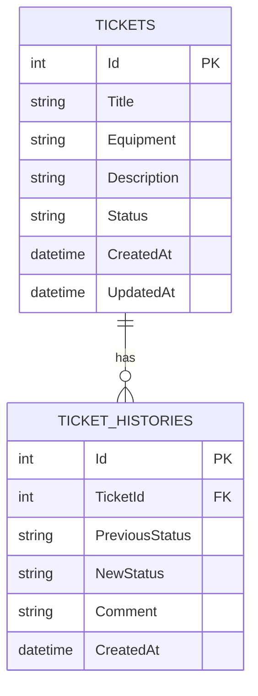
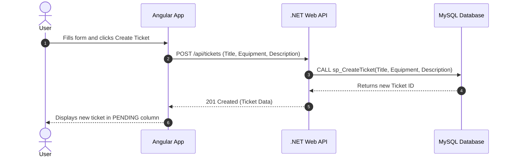
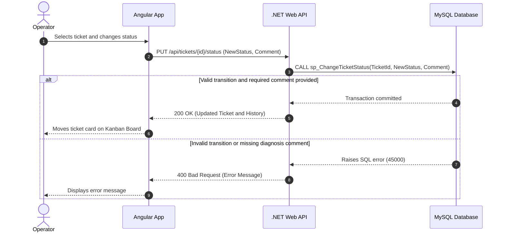

# System Architecture & Diagrams

## 1. Entity Relationship Diagram (ERD)

```mermaid
erDiagram
    TICKETS ||--o{ TICKET_HISTORIES : has

    TICKETS {
        int Id PK
        string Title
        string Equipment
        string Description
        string Status
        datetime CreatedAt
        datetime UpdatedAt
    }

    TICKET_HISTORIES {
        int Id PK
        int TicketId FK
        string PreviousStatus
        string NewStatus
        string Comment
        datetime CreatedAt
    }
```

## 2. Sequence Diagram - Ticket Creation Workflow

```mermaid
sequenceDiagram
    autonumber
    actor User
    participant Frontend as Angular App
    participant API as .NET Web API
    participant DB as MySQL Database

    User->>Frontend: Fills form and clicks Create Ticket
    Frontend->>API: POST /api/tickets (Title, Equipment, Description)
    API->>DB: CALL sp_CreateTicket(Title, Equipment, Description)
    DB-->>API: Returns new Ticket ID
    API-->>Frontend: 201 Created (Ticket Data)
    Frontend-->>User: Displays new ticket in PENDING column
```

## 3. Sequence Diagram - Status Transition Workflow

```mermaid
sequenceDiagram
    autonumber
    actor Operator
    participant Frontend as Angular App
    participant API as .NET Web API
    participant DB as MySQL Database

    Operator->>Frontend: Selects ticket and changes status
    Frontend->>API: PUT /api/tickets/{id}/status (NewStatus, Comment)
    API->>DB: CALL sp_ChangeTicketStatus(TicketId, NewStatus, Comment)

    alt Valid transition and required comment provided
        DB-->>API: Transaction committed
        API-->>Frontend: 200 OK (Updated Ticket and History)
        Frontend-->>Operator: Moves ticket card on Kanban Board
    else Invalid transition or missing diagnosis comment
        DB-->>API: Raises SQL error (45000)
        API-->>Frontend: 400 Bad Request (Error Message)
        Frontend-->>Operator: Displays error message
    end
```
