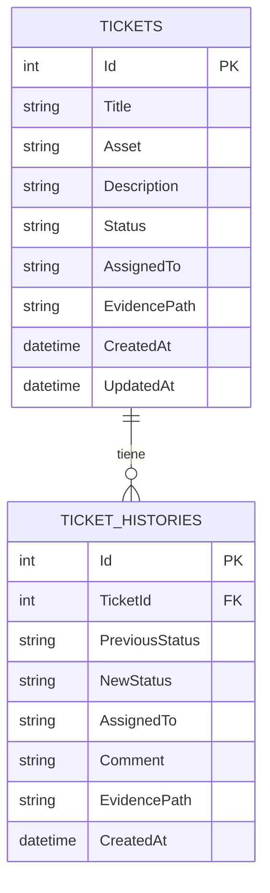
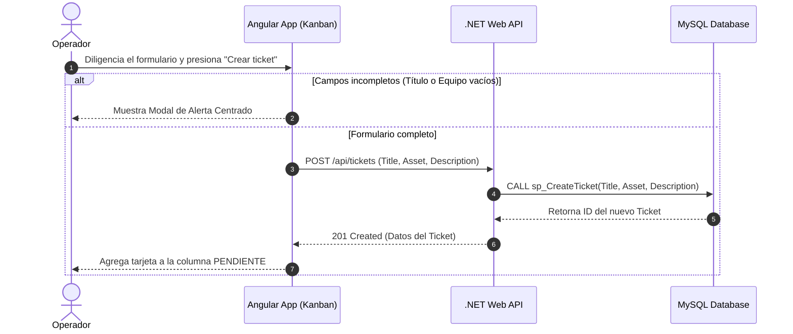
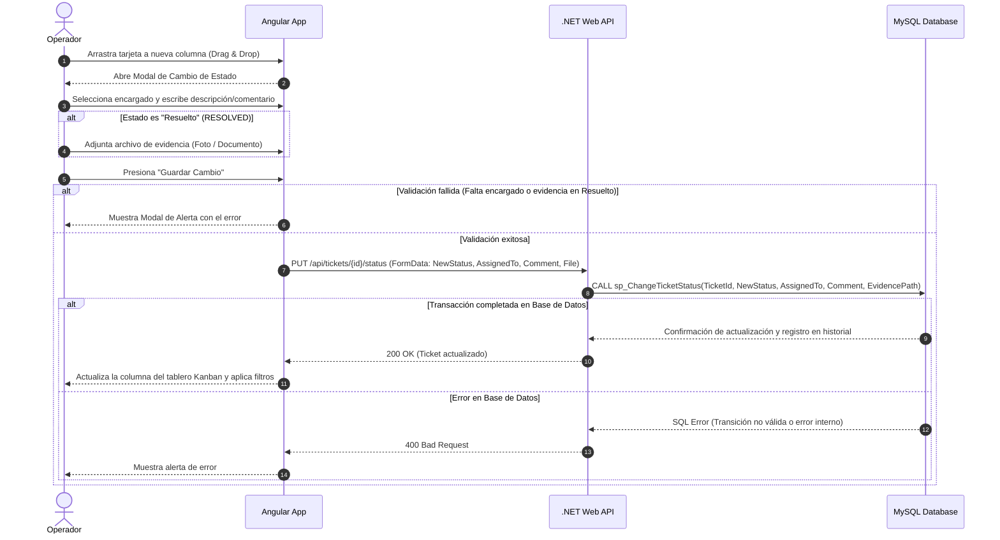
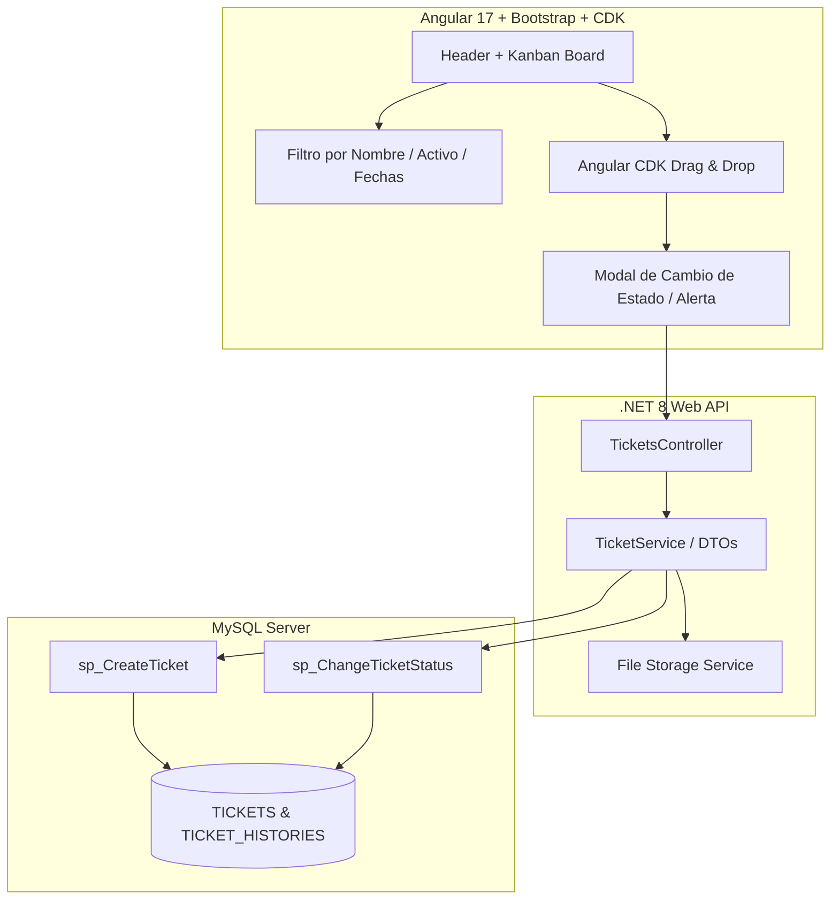

# Arquitectura del Sistema

## 1. Diagrama Entidad-Relación (ERD) Actualizado

## 2. Diagrama de Secuencia - Flujo de Creación de Tickets y Alerta de Validación

## 3. Diagrama de Secuencia - Transición de Estado (Drag & Drop, Asignación y Evidencia)

## 4. Diagrama de Componentes de la Arquitectura (Vista General)

